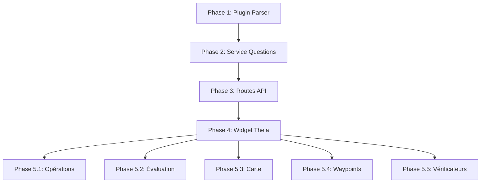

# Plan de Migration : Formula Solver vers Theia

## 📋 Vue d'ensemble

Le Formula Solver permet de résoudre des géocaches Mystery contenant des formules de coordonnées avec des variables (ex: `N 47° 5E.FTN E 006° 5A.JVF`).

### Fonctionnalités principales
1. **Détection de formules** - Parse automatiquement les formules dans la description/waypoints
2. **Extraction de questions** - Trouve les questions associées aux variables (A, B, C, etc.)
3. **Résolution manuelle** - Interface pour saisir les réponses aux questions
4. **Opérations sur réponses** - Checksum, checksum réduit, longueur de texte, etc.
5. **Calcul de coordonnées** - Évalue la formule avec les valeurs saisies
6. **Projection cartographique** - Affiche les résultats possibles sur carte
7. **Intégration waypoints** - Créer/mettre à jour des waypoints avec les résultats

---

## 🏗️ Architecture Actuelle (Ancien Code)

### Backend (Python/Flask)
```
ancien_code_formula_solver/
├── formula_parser/           # Plugin de parsing de formules
│   ├── main.py              # Logique de détection (regex)
│   └── plugin.json          # Métadonnées du plugin
├── formula_questions_service.py  # Extraction des questions (regex/IA)
├── formula_solver_service.py     # Résolution avec IA (non utilisé initialement)
└── formula_solver.html           # Template HTML + Stimulus controller
```

### Composants clés

#### 1. **FormulaParserPlugin** (`formula_parser/main.py`)
- Détecte les coordonnées avec formules dans un texte
- Supporte plusieurs formats :
  - Standard: `N 47° 5E.FTN E 006° 5A.JVF`
  - Avec espaces: `N 48° 41.E D B E 006° 09. F C (A / 2)`
  - Avec opérations: `N49°18.(B-A)(B-C-F)(D+E)`
- Nettoie et normalise les formules

#### 2. **FormulaQuestionsService** (`formula_questions_service.py`)
- **Méthode Regex**: Patterns pour extraire questions (A., B:, C), etc.)
- **Méthode IA**: Utilise l'IA pour extraction intelligente (désactivée initialement)
- Analyse description + waypoints + hints
- Supporte différents formats de questions

#### 3. **FormulaSolverService** (`formula_solver_service.py`)
- Résolution des questions avec IA (non utilisé initialement)
- Extraction de contexte thématique

#### 4. **Frontend** (`formula_solver.html`)
- Stimulus controller `formula-solver`
- Affichage des formules détectées
- Interface de saisie des réponses
- Calcul des opérations (checksum, etc.)
- Substitution et évaluation des formules
- Actions : copier, ajouter waypoint, vérifier avec GeoCheck, etc.

---

## 🎯 Plan de Migration vers Theia

### Phase 1 : Backend - Plugin Formula Parser ✅ (Déjà créé)

**Statut**: Le plugin existe déjà dans `ancien_code_formula_solver/formula_parser`

**Actions**:
1. ✅ Analyser le code existant
2. ⬜ Intégrer comme plugin officiel dans `gc-backend/plugins/official/formula_parser/`
3. ⬜ Adapter le `plugin.json` au nouveau système
4. ⬜ Tester avec le PluginManager

**Fichiers à créer/modifier**:
- `gc-backend/plugins/official/formula_parser/main.py` (copie adaptée)
- `gc-backend/plugins/official/formula_parser/plugin.json` (adapté)

---

### Phase 2 : Backend - Service d'Extraction de Questions

**Objectif**: Service Python pour extraire les questions liées aux variables

**Actions**:
1. ⬜ Créer `gc-backend/services/formula_questions_service.py`
   - Méthode `extract_questions_with_regex(content, letters)`
   - Supporte objet Geocache ou texte brut
   - Patterns regex pour différents formats de questions
2. ⬜ Adapter les patterns regex existants
3. ⬜ Ajouter la préparation du contenu (description + waypoints + hints)
4. ⬜ Tests unitaires

**Note**: On ne migre PAS les méthodes IA pour l'instant (Phase future)

**Fichiers**:
- `gc-backend/services/formula_questions_service.py` (nouveau)

---

### Phase 3 : Backend - Routes API

**Objectif**: Endpoints pour le formula solver

**Actions**:
1. ⬜ Créer `gc-backend/blueprints/formula_solver.py`
2. ⬜ Routes à implémenter:

```python
# Détection de formules
POST /api/formula-solver/detect-formulas
Body: { geocache_id: int, text?: string }
Response: { formulas: [{north, east, source}], ...}

# Extraction de questions
POST /api/formula-solver/extract-questions
Body: { geocache_id: int, letters: string[], method: "regex"|"ai" }
Response: { questions: {A: "...", B: "..."}, ...}

# Calcul de coordonnées
POST /api/formula-solver/calculate
Body: { formula: string, values: {A: 5, B: 3, ...} }
Response: { coordinates: {lat, lon, ddm, dms}, distance_from_origin, ...}
```

3. ⬜ Enregistrer le blueprint dans `app.py`
4. ⬜ Tests d'intégration

**Fichiers**:
- `gc-backend/blueprints/formula_solver.py` (nouveau)
- `gc-backend/app.py` (modifier)

---

### Phase 4 : Frontend - Widget Theia

**Objectif**: Widget Formula Solver intégré dans Theia

**Actions**:
1. ⬜ Créer extension Theia `theia-extensions/formula-solver/`
2. ⬜ Structure :

```
formula-solver/
├── src/
│   ├── browser/
│   │   ├── formula-solver-widget.tsx       # Widget principal
│   │   ├── formula-solver-contribution.ts  # Contribution Theia
│   │   ├── formula-solver-service.ts       # Service API
│   │   ├── formula-solver-frontend-module.ts
│   │   └── components/
│   │       ├── formula-input.tsx           # Saisie formule
│   │       ├── detected-formulas.tsx       # Formules détectées
│   │       ├── question-fields.tsx         # Champs de questions
│   │       ├── value-calculator.tsx        # Calculateur (checksum, etc.)
│   │       └── result-display.tsx          # Affichage résultats
│   └── common/
│       └── types.ts                        # Types TypeScript
├── package.json
└── README.md
```

3. ⬜ Widget principal (`formula-solver-widget.tsx`):
   - État: formule, lettres, questions, valeurs, résultats
   - Sections: formules détectées, saisie, calculs, résultats
   - Boutons d'action: copier, ajouter waypoint, vérifier, etc.

4. ⬜ Service (`formula-solver-service.ts`):
   - Méthodes pour appeler les routes API
   - Gestion du cache et de l'état

5. ⬜ Contribution (`formula-solver-contribution.ts`):
   - Commande pour ouvrir le widget
   - Menu contextuel sur géocaches
   - Intégration dans la barre latérale

**Fichiers**:
- Nombreux fichiers dans `theia-extensions/formula-solver/` (nouveau)

---

### Phase 5 : Fonctionnalités Avancées

**5.1 Opérations sur les valeurs**

⬜ Implémenter les calculateurs:
- Checksum (somme des chiffres)
- Checksum réduit (somme jusqu'à 1 chiffre)
- Longueur de texte
- Position alphabétique (A=1, B=2, etc.)
- Valeurs numériques directes

**5.2 Évaluation de formules**

⬜ Parser et évaluer les expressions:
- Opérations de base: `+`, `-`, `*`, `/`
- Parenthèses: `(A+B)*C`
- Fonctions: `floor()`, `ceil()`, `abs()`
- Sécurité: sandbox pour l'évaluation

**5.3 Projection cartographique**

⬜ Si plusieurs possibilités de réponses:
- Générer toutes les combinaisons
- Calculer les coordonnées pour chaque
- Afficher sur carte OpenLayers
- Filtrer par distance depuis origine (< 3.2 km)

**5.4 Intégration Waypoints**

⬜ Actions sur les résultats:
- Créer waypoint automatiquement
- Ajouter aux waypoints existants
- Mettre à jour les coordonnées de la géocache
- Ouvrir dans GeocacheDetailsWidget

**5.5 Vérificateurs externes**

⬜ Boutons pour checker les coordonnées:
- GeoCheck (si lien dans géocache)
- Geocaching.com checker
- Certitude checker
- Ouvrir dans navigateur avec coordonnées pré-remplies

---

## 📊 Dépendances et Ordre d'Implémentation



---

## 🔄 Différences avec l'Ancien Code

### Améliorations prévues

1. **Architecture**:
   - Séparation claire Backend/Frontend
   - Widget Theia natif (pas de template HTML)
   - Service TypeScript pour API

2. **État**:
   - Gestion d'état React (useState, useEffect)
   - Pas de contrôleur Stimulus

3. **Plugins**:
   - Formula Parser intégré au système de plugins
   - Réutilisation du PluginManager existant

4. **UI/UX**:
   - Design cohérent avec le reste de Theia
   - Meilleure intégration avec les autres widgets
   - Responsive et accessible

5. **Performance**:
   - Calculs côté backend pour formules complexes
   - Cache des résultats côté frontend
   - Lazy loading des composants

### Fonctionnalités à conserver

✅ Détection automatique de formules  
✅ Extraction de questions par regex  
✅ Interface de saisie manuelle  
✅ Opérations sur valeurs (checksum, etc.)  
✅ Calcul de coordonnées  
✅ Actions waypoints  
✅ Vérificateurs externes  

### Fonctionnalités à ajouter plus tard (Phase IA)

🔮 Détection de formules par IA  
🔮 Extraction de questions par IA  
🔮 Résolution automatique des questions  
🔮 Suggestions intelligentes  

---

## 🧪 Tests à Prévoir

### Backend
- [ ] Tests unitaires pour `FormulaParserPlugin`
- [ ] Tests pour `formula_questions_service`
- [ ] Tests d'intégration des routes API
- [ ] Tests de sécurité (évaluation de formules)

### Frontend
- [ ] Tests React pour chaque composant
- [ ] Tests d'intégration du widget
- [ ] Tests E2E avec Playwright
- [ ] Tests d'accessibilité

---

## 📝 Documentation

À créer:
- [ ] README pour le plugin formula_parser
- [ ] Documentation API pour les routes
- [ ] Guide utilisateur du widget
- [ ] Exemples de formules supportées
- [ ] Guide de contribution

---

## ⏱️ Estimation Temporelle

| Phase | Complexité | Temps estimé |
|-------|-----------|--------------|
| Phase 1 : Plugin Parser | Faible (code existe) | 1-2h |
| Phase 2 : Service Questions | Moyenne | 3-4h |
| Phase 3 : Routes API | Faible | 2-3h |
| Phase 4 : Widget Theia | Élevée | 8-10h |
| Phase 5.1 : Opérations | Moyenne | 2-3h |
| Phase 5.2 : Évaluation | Moyenne | 3-4h |
| Phase 5.3 : Carte | Moyenne | 4-5h |
| Phase 5.4 : Waypoints | Faible | 2-3h |
| Phase 5.5 : Vérificateurs | Faible | 1-2h |
| **TOTAL** | | **26-36h** |

---

## 🚀 Prochaines Étapes Immédiates

1. **Valider le plan** avec l'utilisateur
2. **Commencer Phase 1**: Intégrer le plugin formula_parser
3. **Phase 2**: Créer le service d'extraction de questions
4. **Phase 3**: Implémenter les routes API
5. **Phase 4**: Développer le widget Theia

---

## 📌 Notes Importantes

- ⚠️ **Pas d'IA pour l'instant**: On utilise uniquement les regex
- ✅ **Réutilisation maximale**: L'ancien code est robuste et testé
- 🎯 **Focus sur l'intégration Theia**: Architecture moderne et maintenable
- 🔒 **Sécurité**: Attention à l'évaluation des formules (sandbox)
- 🗺️ **Géolocalisation**: Distance max 3.2 km des coordonnées d'origine

---

**Prêt à commencer l'implémentation ! 🎉**
